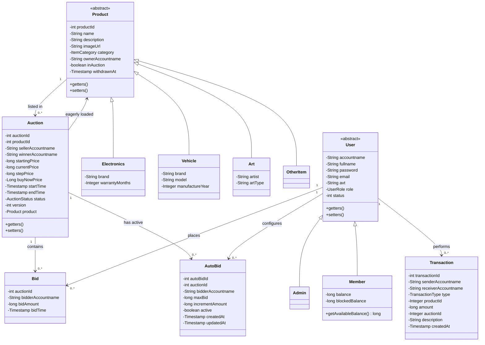

# Core Domain Model Architecture

This document outlines the core domain model of the Bidding System, detailing the primary entities, their attributes, and the relationships that drive the business logic of the application.

## 1. Domain Entities Overview

The system is built around several key entities:
*   **User Hierarchy**: Represents the participants in the system, utilizing inheritance to distinguish between regular `Member`s and administrative `Admin`s.
*   **Product Hierarchy**: Represents the physical items that users own, with specific subtypes for various categories (`Electronics`, `Vehicle`, `Art`, `OtherItem`). A `Product` is independent of any auction — the same product can be listed for auction multiple times.
*   **Auction**: Represents a single auction session tied to a `Product`. Manages the entire lifecycle from `OPEN` → `RUNNING` → `FINISHED`/`CANCELED`.
*   **Bidding Mechanics**: `Bid` records each individual bid placed; `AutoBid` stores an automatic bidding configuration for a user on a given auction.
*   **Financials**: The `Transaction` entity records all financial movements, ensuring auditability and balance integrity.

## 2. Class Diagram

## Design Decisions & Patterns
    
*   **Singleton DAO Pattern**: All data access objects (`UserDao`, `ProductDao`, `AuctionDao`, etc.) follow the Singleton pattern to ensure global access points for database operations and consistent statement caching if applicable.
*   **Separation of Product and Auction**: `Product` represents a physical asset the user owns. `Auction` is a time-bounded event referencing that product. This 1-to-many relationship allows a product to be re-auctioned after a failed or cancelled session.
*   **Inheritance (IS-A Relationship)**: `User` and `Product` are abstract base classes, enabling polymorphic behavior across specific user roles and product categories.
*   **Factory Method Pattern**: `ItemFactory.createProduct(category, json)` encapsulates instantiation of the correct `Product` subclass at runtime.
*   **Eager Loading**: `Auction` carries a `Product` field that is populated via a SQL JOIN in most queries, avoiding N+1 issues in the auction list and detail views.
*   **Optimistic Locking**: The `version` field on `Auction` supports legacy optimistic-lock checks. Active concurrency control is enforced via pessimistic row-level locking (`SELECT ... FOR UPDATE`) at the database level.
*   **Escrow Model**: `Member` holds two balance fields — `balance` (total funds) and `blockedBalance` (funds reserved for active bids). Available funds = `balance − blockedBalance`. The database enforces `balance >= blocked_balance` at all times.