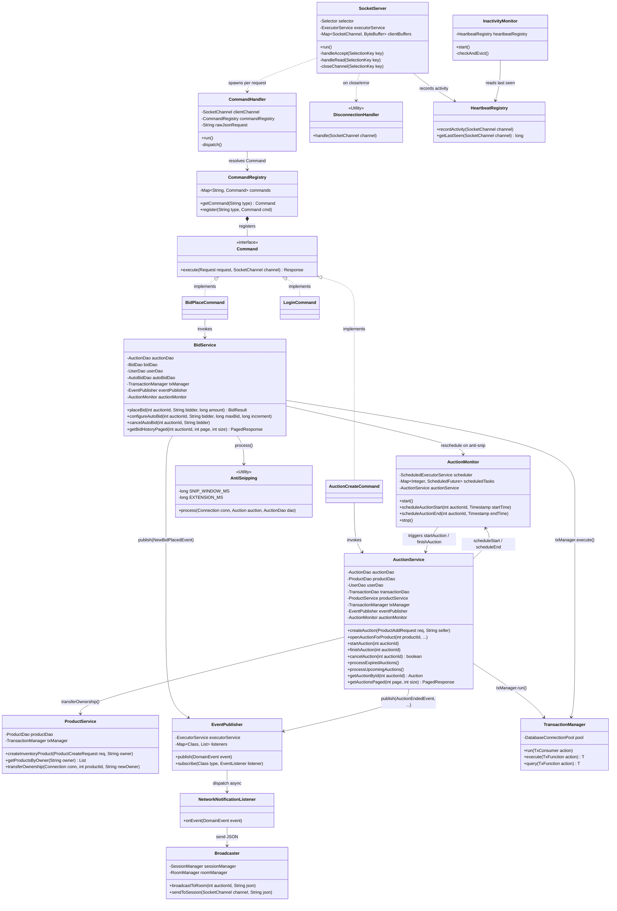

# Server Architecture Class Diagram

This document illustrates the structural architecture of the server-side application. It emphasises the network layer, request dispatching, and the core service components that drive the auction lifecycle.

## 1. Architectural Components

The server is divided into several distinct layers:
*   **Networking Layer**: Manages asynchronous TCP connections using Java NIO (`SocketServer`, `DisconnectionHandler`, `HeartbeatRegistry`, `InactivityMonitor`).
*   **Command Dispatching**: Implements the Command Pattern to route raw JSON requests to typed business handlers (`CommandHandler`, `CommandRegistry`, `Command` interface).
*   **Business Services**: Contains domain logic split by responsibility — `AuctionService` (lifecycle), `BidService` (bid placement & auto-bidding), `ProductService` (inventory), finance services (`DepositService`, `WithdrawService`, `TransferService`), and user services (`AuthService`, `UserService`, `AdminService`).
*   **Event-Driven Subsystem**: Decouples domain state changes from network broadcasting via an internal Pub/Sub bus (`EventPublisher`, `NetworkNotificationListener`, `Broadcaster`).
*   **Persistence Layer**: `TransactionManager` wraps every mutation in a JDBC transaction; individual DAOs (`AuctionDao`, `BidDao`, `ProductDao`, `UserDao`, `AutoBidDao`, `TransactionDao`) handle SQL.

## 2. Server Class Diagram

## 3. Key Design Patterns

*   **Reactor Pattern (NIO)**: `SocketServer` uses a `Selector` to multiplex I/O events across thousands of concurrent TCP connections on a small thread pool.
*   **Command Pattern**: Each JSON `type` field maps to a dedicated `Command` implementation, isolating request parsing from business logic and eliminating large `switch` blocks.
*   **Publish-Subscribe (Observer)**: `EventPublisher` dispatches `DomainEvent`s asynchronously. `BidService` and `AuctionService` publish events without any knowledge of how clients are notified.
*   **Circular Dependency Resolution**: `AuctionService` and `AuctionMonitor` depend on each other. The dependency is broken by injecting `AuctionMonitor` via `AuctionService.setAuctionMonitor()` after both objects are constructed in `ServerApp`.
*   **Template Method (TransactionManager)**: `txManager.run()`, `execute()`, and `query()` provide a uniform transactional wrapper, ensuring every DB mutation is automatically committed or rolled back.