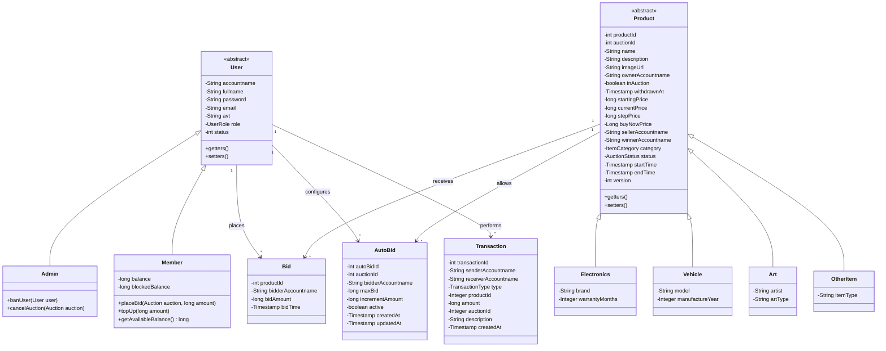

# Core Domain Model Architecture

This document outlines the core domain model of the Bidding System, detailing the primary entities, their attributes, and the relationships that drive the business logic of the application.

## 1. Domain Entities Overview

The system is built around several key entities:
*   **User Hierarchy**: Represents the participants in the system, utilizing inheritance to distinguish between regular `Member`s and administrative `Admin`s.
*   **Product Hierarchy**: Represents the items being auctioned, with specific subtypes for various categories (e.g., `Electronics`, `Vehicle`).
*   **Bidding Mechanics**: Entities like `Bid` and `AutoBid` manage the transactional interactions within an auction.
*   **Financials**: The `Transaction` entity records all financial movements, ensuring auditability and balance integrity.

## 2. Class Diagram

The following Mermaid class diagram illustrates the object-oriented design of the domain layer.

## 3. Design Decisions & Patterns

*   **Inheritance (IS-A Relationship)**: The `User` and `Product` classes are designed as abstract base classes. This allows for polymorphic behavior and shared attributes across all specific user roles and product categories.
*   **Composition (HAS-A Relationship)**: `User` and `Product` associate with `Bid`, `AutoBid`, and `Transaction` via one-to-many relationships.
*   **Optimistic Locking**: The `version` attribute in `Product` (representing the Auction state) is crucial for optimistic concurrency control, preventing race conditions during simultaneous bidding.
