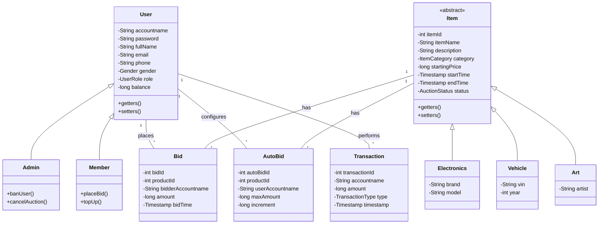

# Core Domain Model Class Diagram

```mermaid
classDiagram
    class User {
        -String accountname
        -String password
        -String fullName
        -String email
        -String phone
        -Gender gender
        -UserRole role
        -long balance
        +getters()
        +setters()
    }

    class Admin {
        +banUser()
        +cancelAuction()
    }

    class Member {
        +placeBid()
        +topUp()
    }

    User <|-- Admin
    User <|-- Member

    class Item {
        <<abstract>>
        -int itemId
        -String itemName
        -String description
        -ItemCategory category
        -long startingPrice
        -Timestamp startTime
        -Timestamp endTime
        -AuctionStatus status
        +getters()
        +setters()
    }

    class Electronics {
        -String brand
        -String model
    }

    class Vehicle {
        -String vin
        -int year
    }

    class Art {
        -String artist
    }

    Item <|-- Electronics
    Item <|-- Vehicle
    Item <|-- Art

    class Bid {
        -int bidId
        -int productId
        -String bidderAccountname
        -long amount
        -Timestamp bidTime
    }

    class AutoBid {
        -int autoBidId
        -int productId
        -String userAccountname
        -long maxAmount
        -long increment
    }

    class Transaction {
        -int transactionId
        -String accountname
        -long amount
        -TransactionType type
        -Timestamp timestamp
    }

    User "1" -- "*" Bid : places
    Item "1" -- "*" Bid : has
    User "1" -- "*" AutoBid : configures
    Item "1" -- "*" AutoBid : has
    User "1" -- "*" Transaction : performs
```
