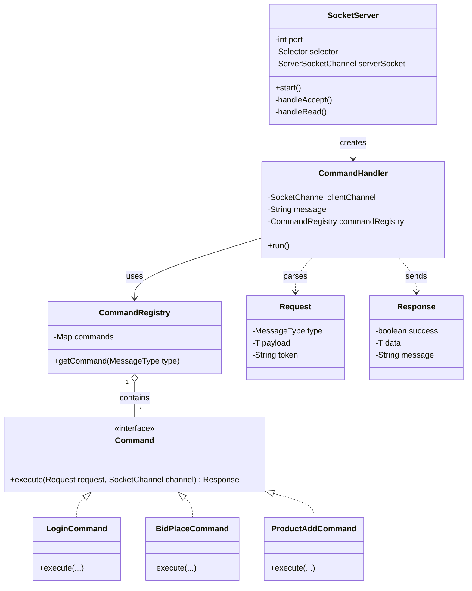

# Server Architecture Class Diagram (Command Pattern)

```mermaid
classDiagram
    class SocketServer {
        -int port
        -Selector selector
        -ServerSocketChannel serverSocket
        +start()
        -handleAccept()
        -handleRead()
    }

    class CommandHandler {
        -SocketChannel clientChannel
        -String message
        -CommandRegistry commandRegistry
        +run()
    }

    class CommandRegistry {
        -Map<MessageType, Command> commands
        +getCommand(MessageType type)
    }

    class Command {
        <<interface>>
        +execute(Request request, SocketChannel channel) Response
    }

    class LoginCommand {
        +execute(...)
    }

    class BidPlaceCommand {
        +execute(...)
    }

    class ProductAddCommand {
        +execute(...)
    }

    SocketServer ..> CommandHandler : creates
    CommandHandler --> CommandRegistry : uses
    CommandRegistry "1" o-- "*" Command : contains
    Command <|.. LoginCommand
    Command <|.. BidPlaceCommand
    Command <|.. ProductAddCommand

    class Request {
        -MessageType type
        -T payload
        -String token
    }

    class Response {
        -boolean success
        -T data
        -String message
    }

    CommandHandler ..> Request : parses
    CommandHandler ..> Response : sends
```
