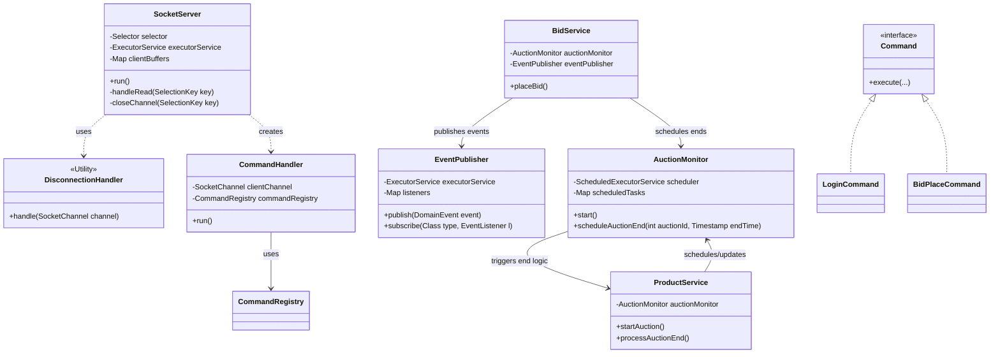

# Server Architecture Class Diagram

```mermaid
classDiagram
    class SocketServer {
        -Selector selector
        -ExecutorService executorService
        -Map clientBuffers
        +run()
        -handleRead(SelectionKey key)
        -closeChannel(SelectionKey key)
    }

    class DisconnectionHandler {
        <<Utility>>
        +handle(SocketChannel channel)
    }

    class AuctionMonitor {
        -ScheduledExecutorService scheduler
        -Map scheduledTasks
        +start()
        +scheduleAuctionEnd(int auctionId, Timestamp endTime)
    }

    class EventPublisher {
        -ExecutorService executorService
        -Map listeners
        +publish(DomainEvent event)
        +subscribe(Class type, EventListener l)
    }

    class BidService {
        -AuctionMonitor auctionMonitor
        -EventPublisher eventPublisher
        +placeBid()
    }

    class ProductService {
        -AuctionMonitor auctionMonitor
        +startAuction()
        +processAuctionEnd()
    }

    class CommandHandler {
        -SocketChannel clientChannel
        -CommandRegistry commandRegistry
        +run()
    }

    SocketServer ..> CommandHandler : creates
    SocketServer ..> DisconnectionHandler : uses
    CommandHandler --> CommandRegistry : uses
    
    BidService --> AuctionMonitor : schedules ends
    BidService --> EventPublisher : publishes events
    ProductService --> AuctionMonitor : schedules/updates
    
    AuctionMonitor --> ProductService : triggers end logic
    
    class Command {
        <<interface>>
        +execute(...)
    }

    Command <|.. LoginCommand
    Command <|.. BidPlaceCommand
```
