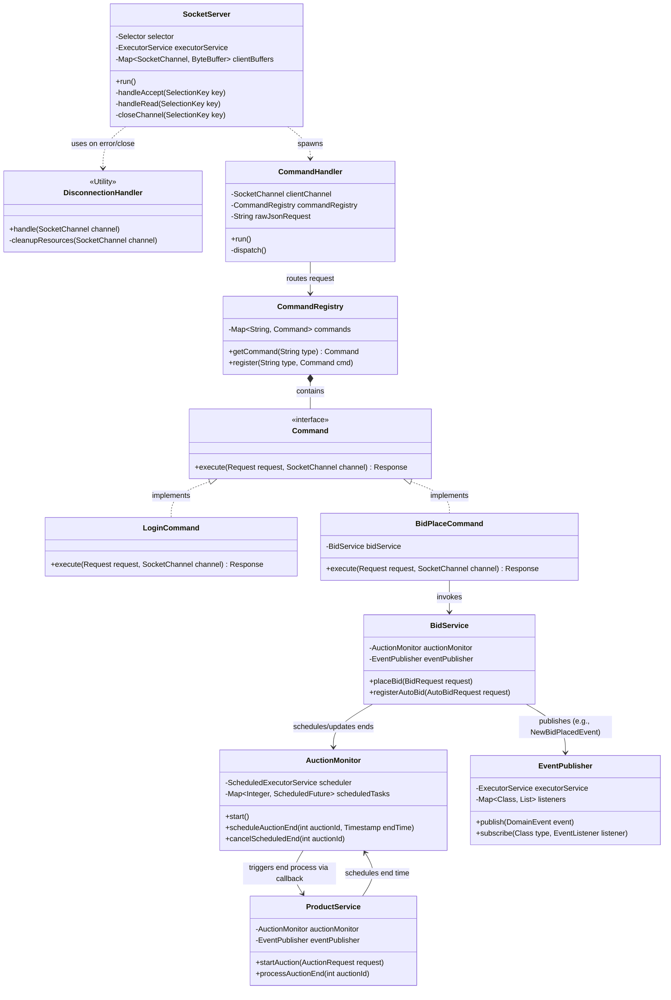

# Server Architecture Class Diagram

This document illustrates the structural architecture of the server-side application. It emphasizes the network layer, request dispatching, and core service components.

## 1. Architectural Components

The server architecture is modularized into several distinct responsibilities:
*   **Networking Layer**: Manages asynchronous TCP connections using Java NIO (`SocketServer`, `DisconnectionHandler`).
*   **Command Dispatching**: Implements the Command Pattern to decouple network requests from business logic (`CommandHandler`, `CommandRegistry`, `Command` interface).
*   **Business Services**: Contains the core logic for bidding, product management, and auction lifecycle (`BidService`, `ProductService`).
*   **Event-Driven Subsystem**: Handles asynchronous, non-blocking internal notifications and broadcast updates (`EventPublisher`, `AuctionMonitor`).

## 2. Server Class Diagram

## 3. Key Design Patterns

*   **Reactor Pattern (NIO)**: `SocketServer` uses a `Selector` to multiplex incoming network events, allowing a single thread to manage thousands of concurrent connections efficiently.
*   **Command Pattern**: By encapsulating requests as `Command` objects, the server easily routes raw JSON to specific business handlers without giant `switch` statements.
*   **Observer/Publish-Subscribe Pattern**: `EventPublisher` decouples services. For instance, `BidService` doesn't need to know how to notify users; it simply publishes a `NewBidPlacedEvent`, and specialized listeners broadcast it.
