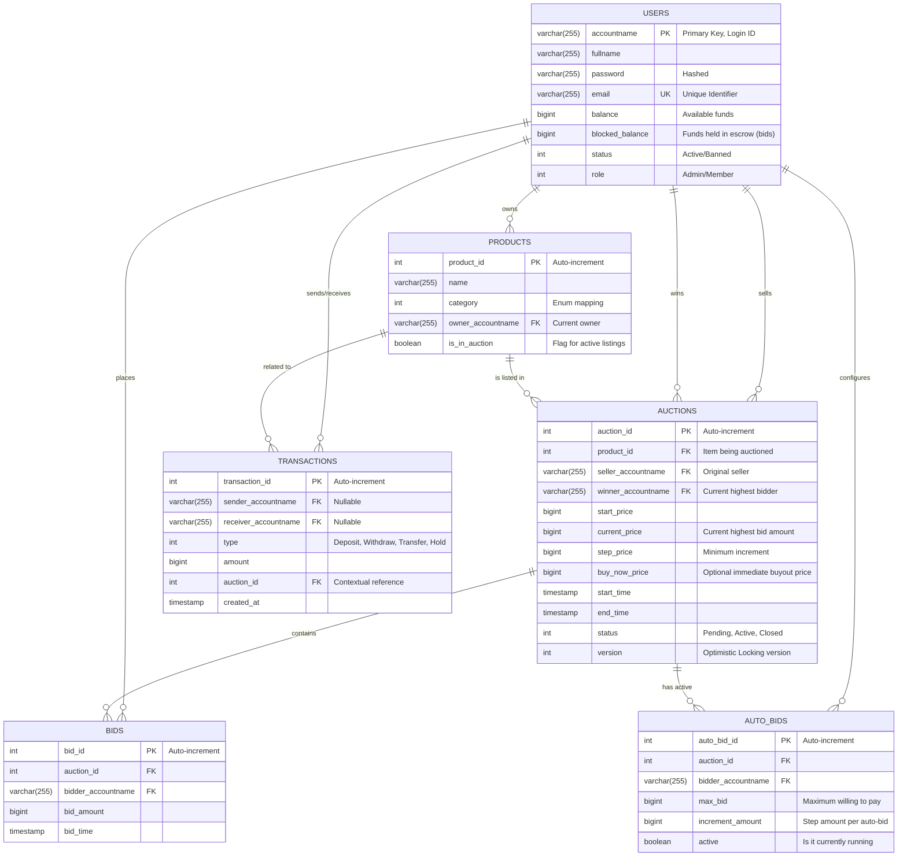

# Database Schema & Data Integrity Constraints

This document details the Entity-Relationship Diagram (ERD) and the strict data integrity rules implemented at the database tier of the Bidding System. The database serves as the ultimate source of truth, enforcing critical business rules at the lowest level.

## 1. Entity-Relationship Diagram (ERD)

The following diagram visualizes the relational structure of the system's database.

## 2. Advanced Data Constraints (The Last Line of Defense)

To ensure the system is resilient against application-level bugs and race conditions, critical financial and business logic constraints are enforced directly in the MySQL database using `CHECK` constraints.

### 2.1 User Financial Protection (`users` table)
*   **Non-Negative Balance**: `CHECK (balance >= 0)` ensures an account can never be overdrawn.
*   **Non-Negative Escrow**: `CHECK (blocked_balance >= 0)` ensures escrow funds are logically sound.
*   **Total Asset Integrity**: `CHECK (balance >= blocked_balance)` guarantees that the system cannot freeze more funds than the user actually possesses.

### 2.2 Auction Integrity (`auctions` table)
*   **Positive Pricing**: `CHECK (start_price >= 0)` and `CHECK (step_price > 0)` enforce valid monetary values.
*   **Bid Escalation Rule**: `CHECK (current_price >= start_price)` prevents scenarios where the current price drops below the starting baseline.
*   **Buyout Logic**: `CHECK (buy_now_price IS NULL OR buy_now_price > start_price)` mandates that a buyout price must be a premium over the starting price.
*   **Chronological Order**: `CHECK (end_time > start_time)` prevents impossible auction durations.

### 2.3 Transaction Validity (`transactions` table)
*   **Meaningful Transfers**: `CHECK (amount > 0)` prevents zero-value transactions, mitigating potential database spam or denial-of-service vectors.

## 3. Foreign Key & Cascade Policies

The database utilizes strict foreign key referencing to maintain referential integrity, with carefully considered cascading policies:
*   **`ON DELETE CASCADE`**: When a `User` is deleted (if applicable), their `Products`, `Bids`, and `AutoBids` are automatically removed to maintain a clean state.
*   **`ON DELETE SET NULL`**: Financial history is immutable. When a `User` is removed, related `Transactions` are kept for auditing purposes. The `sender_accountname` or `receiver_accountname` fields are set to `NULL` to reflect the account's deletion while preserving the ledger.
