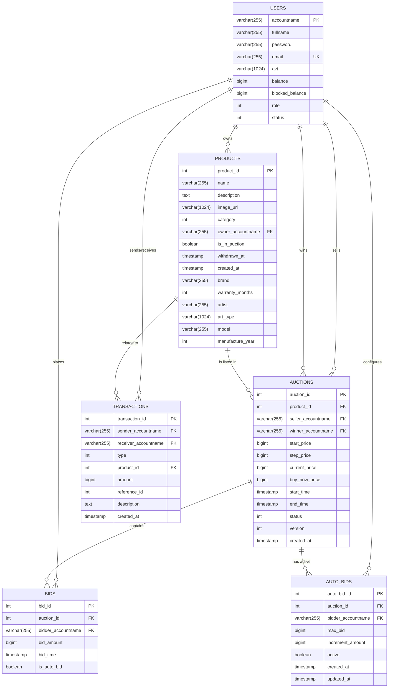

# Database Entity-Relationship Diagram (ERD)

```mermaid
erDiagram
    USERS ||--o{ PRODUCTS : "owns"
    USERS ||--o{ AUCTIONS : "sells"
    USERS ||--o{ AUCTIONS : "wins"
    USERS ||--o{ BIDS : "places"
    USERS ||--o{ AUTO_BIDS : "configures"
    USERS ||--o{ TRANSACTIONS : "sends/receives"
    
    PRODUCTS ||--o{ AUCTIONS : "is listed in"
    PRODUCTS ||--o{ TRANSACTIONS : "related to"
    
    AUCTIONS ||--o{ BIDS : "contains"
    AUCTIONS ||--o{ AUTO_BIDS : "has active"

    USERS {
        varchar(255) accountname PK
        varchar(255) fullname
        varchar(255) password
        varchar(255) email UK
        varchar(1024) avt
        bigint balance
        bigint blocked_balance
        int role
        int status
    }

    PRODUCTS {
        int product_id PK
        varchar(255) name
        text description
        varchar(1024) image_url
        int category
        varchar(255) owner_accountname FK
        boolean is_in_auction
        timestamp withdrawn_at
        timestamp created_at
        varchar(255) brand
        int warranty_months
        varchar(255) artist
        varchar(1024) art_type
        varchar(255) model
        int manufacture_year
    }

    AUCTIONS {
        int auction_id PK
        int product_id FK
        varchar(255) seller_accountname FK
        varchar(255) winner_accountname FK
        bigint start_price
        bigint step_price
        bigint current_price
        bigint buy_now_price
        timestamp start_time
        timestamp end_time
        int status
        int version
        timestamp created_at
    }

    BIDS {
        int bid_id PK
        int auction_id FK
        varchar(255) bidder_accountname FK
        bigint bid_amount
        timestamp bid_time
        boolean is_auto_bid
    }

    AUTO_BIDS {
        int auto_bid_id PK
        int auction_id FK
        varchar(255) bidder_accountname FK
        bigint max_bid
        bigint increment_amount
        boolean active
        timestamp created_at
        timestamp updated_at
    }

    TRANSACTIONS {
        int transaction_id PK
        varchar(255) sender_accountname FK
        varchar(255) receiver_accountname FK
        int type
        int product_id FK
        bigint amount
        int reference_id
        text description
        timestamp created_at
    }
```
