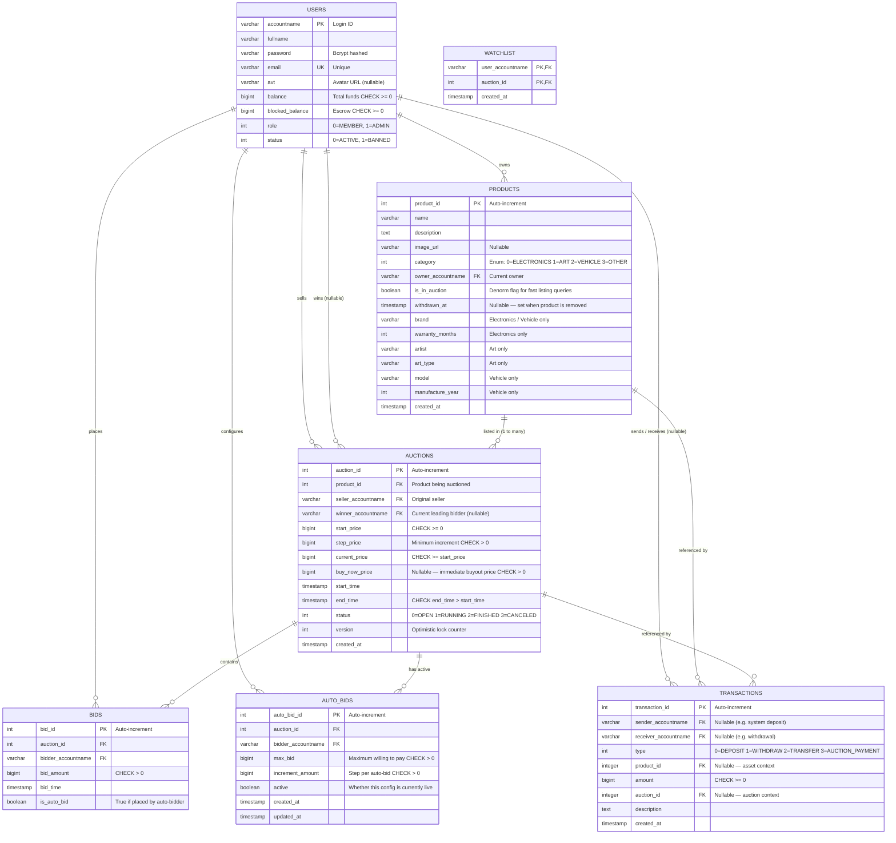

# Database Schema & Data Integrity Constraints

This document details the Entity-Relationship Diagram (ERD) and the strict data integrity rules implemented at the database tier of the Bidding System. The database serves as the ultimate source of truth, enforcing critical business rules at the lowest level.

## 1. Entity-Relationship Diagram (ERD)

## 2. Data Integrity Constraints

Critical financial and business rules are enforced directly in MySQL using `CHECK` constraints and foreign keys, acting as a safety net against application-level bugs.

### 2.1 User Financial Protection (`users`)
| Constraint | Rule |
|---|---|
| `CHECK (balance >= 0)` | Account can never be overdrawn |
| `CHECK (blocked_balance >= 0)` | Escrow funds are always non-negative |
| `CHECK (balance >= blocked_balance)` | System cannot freeze more than the user owns |

### 2.2 Auction Integrity (`auctions`)
| Constraint | Rule |
|---|---|
| `CHECK (start_price >= 0)` | Valid monetary starting value |
| `CHECK (step_price > 0)` | Bid increment must be positive |
| `CHECK (current_price >= start_price)` | Price can never drop below starting |
| `CHECK (buy_now_price IS NULL OR buy_now_price > 0)` | Buy-now must be positive if set |
| `CHECK (end_time > start_time)` | Auction must have a positive duration |

> **Note**: The application additionally validates that `buy_now_price > start_price` at the service layer before persisting.

### 2.3 Transaction Validity (`transactions`)
| Constraint | Rule |
|---|---|
| `CHECK (amount >= 0)` | No negative-value transactions |

### 2.4 Bid Validity (`bids`)
| Constraint | Rule |
|---|---|
| `CHECK (bid_amount > 0)` | Every bid must be a positive amount |

## 3. Data Access Objects (DAO)
All persistence logic is encapsulated in Singleton DAOs (e.g., `AuctionDao.getInstance()`), ensuring thread-safe access to the database via the `TransactionManager`.

## 4. Foreign Key Cascade Policies

| Relationship | On Delete |
|---|---|
| `products.owner_accountname → users` | `CASCADE` — deletes user's products |
| `auctions.product_id → products` | `CASCADE` — removes auctions for deleted products |
| `auctions.seller_accountname → users` | `CASCADE` |
| `auctions.winner_accountname → users` | `SET NULL` — preserves auction record |
| `bids.auction_id → auctions` | `CASCADE` |
| `bids.bidder_accountname → users` | `CASCADE` |
| `auto_bids.auction_id → auctions` | `CASCADE` |
| `auto_bids.bidder_accountname → users` | `CASCADE` |
| `transactions.sender_accountname → users` | `SET NULL` — financial history is immutable |
| `transactions.receiver_accountname → users` | `SET NULL` |
| `transactions.product_id → products` | `SET NULL` |
| `transactions.auction_id → auctions` | `SET NULL` |
| `watchlist.user_accountname → users` | `CASCADE` |
| `watchlist.product_id → products` | `CASCADE` |

## 4. Indexes

| Index | Columns | Purpose |
|---|---|---|
| `idx_products_owner` | `owner_accountname` | Fast "my inventory" queries |
| `idx_products_auction` | `is_in_auction` | Filter active listings |
| `idx_auctions_product` | `product_id` | Auction history per product |
| `idx_auctions_status_end_time` | `(status, end_time)` | AuctionMonitor expired/upcoming lookups |
| `idx_bids_auction_amount` | `(auction_id, bid_amount DESC)` | Auto-bidding sort |
| `idx_auto_bids_auction` | `(auction_id, active, max_bid)` | Active auto-bid lookups |
| `idx_watchlist_user` | `user_accountname` | User's watchlist lookup |
| `idx_watchlist_product` | `product_id` | Find all watchers of a product |
| `idx_transactions_sender` | `sender_accountname` | Transaction history |
| `idx_transactions_receiver` | `receiver_accountname` | Transaction history |
| `idx_transactions_auction` | `auction_id` | Auction payment lookups |