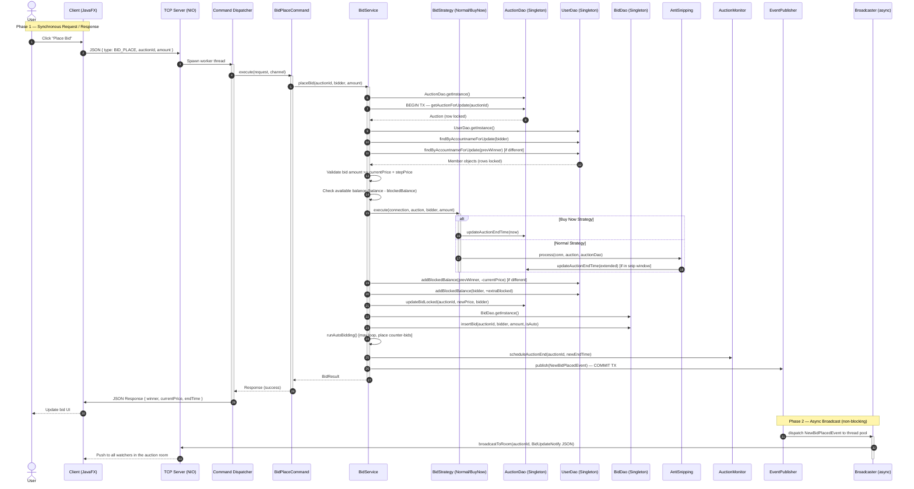
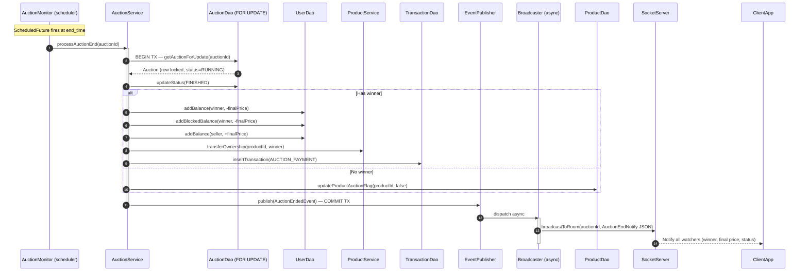

# Request Processing Sequence Diagram

This document traces the lifecycle of two critical flows: a **manual bid** (the most complex synchronous path) and **auction finalization** (the automated timer-driven path).

---

## 1. Flow A — Manual Bid Placement (Synchronous + Async Notify)

Illustrates the end-to-end path from the moment a user clicks "Bid" through database settlement and realtime broadcast to all watchers.

---

## 2. Flow B — Automated Auction Finalization (Timer-driven)

Triggered by `AuctionMonitor`'s `ScheduledExecutorService` when the auction's `end_time` is reached.

---

## 3. Key Design Properties

| Property | Implementation |
|---|---|
| **Non-blocking response** | `EventPublisher.publish()` returns immediately; broadcast runs on a separate thread pool |
| **Deadlock prevention** | Users are always locked in alphabetical order (`bidder.compareTo(prevWinner)`) |
| **Rollback on failure** | `TransactionManager` catches any exception and issues a full `ROLLBACK` before propagating |
| **Anti-snipping** | Any bid inside the final `ANTI_SNIP_WINDOW_MS` extends `end_time` by `ANTI_SNIP_EXTENSION_MS`; `AuctionMonitor` reschedules the closure task accordingly |
| **Auto-bid loop** | After each manual bid, `runAutoBidding()` runs within the same transaction to settle all configured auto-bids before committing |