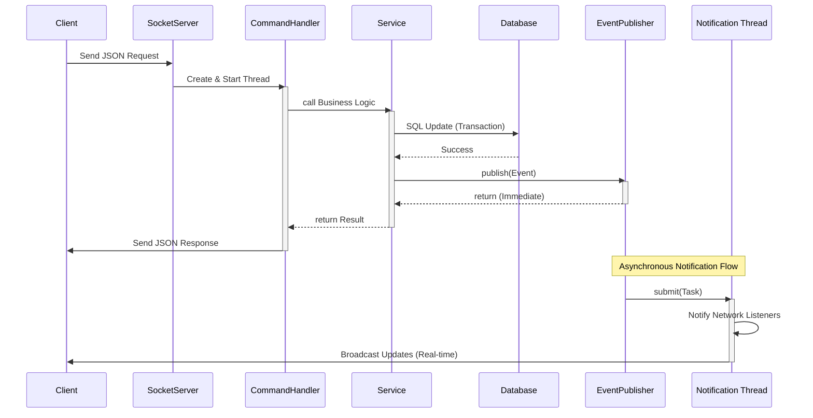

# Request Processing Sequence Diagram

```mermaid
sequenceDiagram
    participant Client
    participant SocketServer
    participant CommandHandler
    participant Service
    participant Database
    participant EventPublisher
    participant AsyncThread as Notification Thread

    Client->>SocketServer: Send JSON Request
    SocketServer->>CommandHandler: Create & Start Thread
    activate CommandHandler
    CommandHandler->>Service: call Business Logic
    activate Service
    Service->>Database: SQL Update (Transaction)
    Database-->>Service: Success
    Service->>EventPublisher: publish(Event)
    activate EventPublisher
    EventPublisher-->>Service: return (Immediate)
    deactivate EventPublisher
    
    Service-->>CommandHandler: return Result
    deactivate Service
    
    CommandHandler->>Client: Send JSON Response
    deactivate CommandHandler

    Note over EventPublisher, AsyncThread: Asynchronous Notification Flow
    EventPublisher->>AsyncThread: submit(Task)
    activate AsyncThread
    AsyncThread->>AsyncThread: Notify Network Listeners
    AsyncThread->>Client: Broadcast Updates (Real-time)
    deactivate AsyncThread
```
