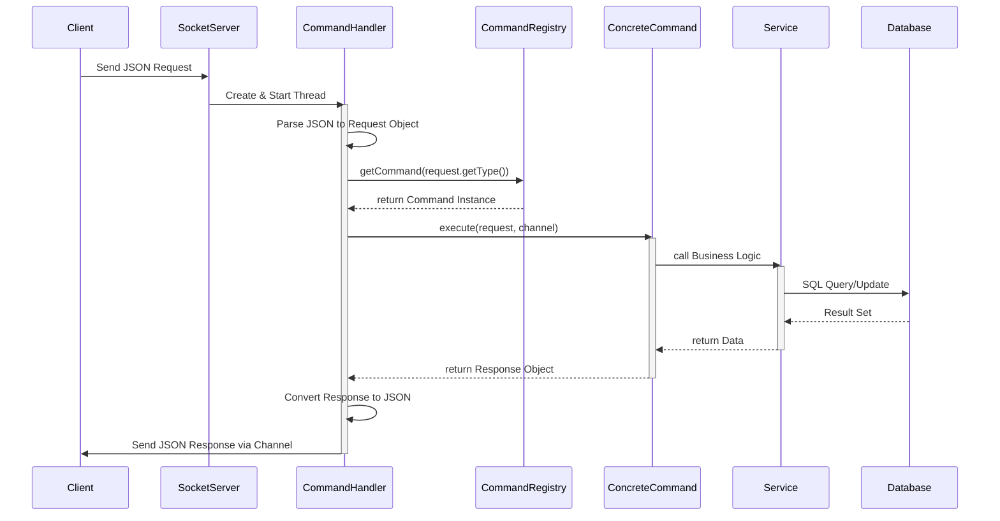

# Request Processing Sequence Diagram

```mermaid
sequenceDiagram
    participant Client
    participant SocketServer
    participant CommandHandler
    participant CommandRegistry
    participant ConcreteCommand
    participant Service
    participant Database

    Client->>SocketServer: Send JSON Request
    SocketServer->>CommandHandler: Create & Start Thread
    activate CommandHandler
    CommandHandler->>CommandHandler: Parse JSON to Request Object
    CommandHandler->>CommandRegistry: getCommand(request.getType())
    CommandRegistry-->>CommandHandler: return Command Instance
    CommandHandler->>ConcreteCommand: execute(request, channel)
    activate ConcreteCommand
    ConcreteCommand->>Service: call Business Logic
    activate Service
    Service->>Database: SQL Query/Update
    Database-->>Service: Result Set
    Service-->>ConcreteCommand: return Data
    deactivate Service
    ConcreteCommand-->>CommandHandler: return Response Object
    deactivate ConcreteCommand
    CommandHandler->>CommandHandler: Convert Response to JSON
    CommandHandler->>Client: Send JSON Response via Channel
    deactivate CommandHandler
```
