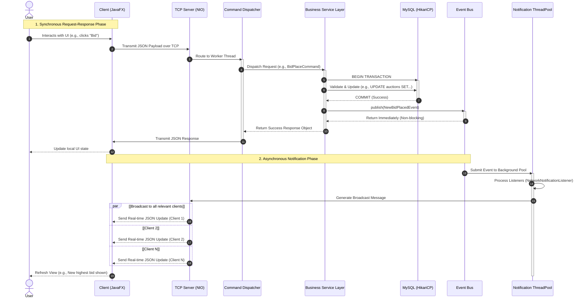

# Request Processing Sequence Diagram

This sequence diagram illustrates the lifecycle of a single request originating from the Client, traversing through the Server's networking and business logic layers, updating the Database, and finally triggering asynchronous real-time notifications to all connected clients.

## 1. End-to-End Execution Flow

The flow is divided into two distinct phases:
1.  **Synchronous Request-Response Cycle**: The immediate processing of the user's action (e.g., placing a bid) and the direct response indicating success or failure.
2.  **Asynchronous Notification Cycle**: The decoupled background process that broadcasts the state change to all interested parties (e.g., updating the UI of everyone watching the auction).

## 2. Sequence Diagram

## 3. Key Takeaways

*   **Non-Blocking I/O**: The `EventPublisher` returns immediately, ensuring the user placing the bid receives their confirmation without waiting for the server to notify hundreds of other users.
*   **Database Transactions**: Critical operations are wrapped in ACID-compliant transactions, ensuring that if anything fails (e.g., insufficient funds), the rollback happens safely before any success response or event is emitted.
*   **Scalable Broadcasting**: By delegating the broadcasting task to an `AsyncThread`, the server's primary request-handling threads remain free to process new incoming commands.
