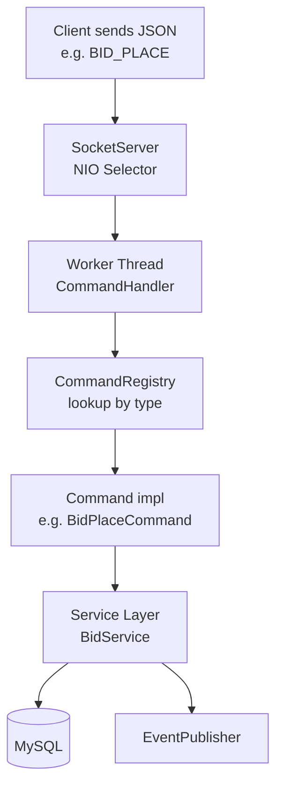
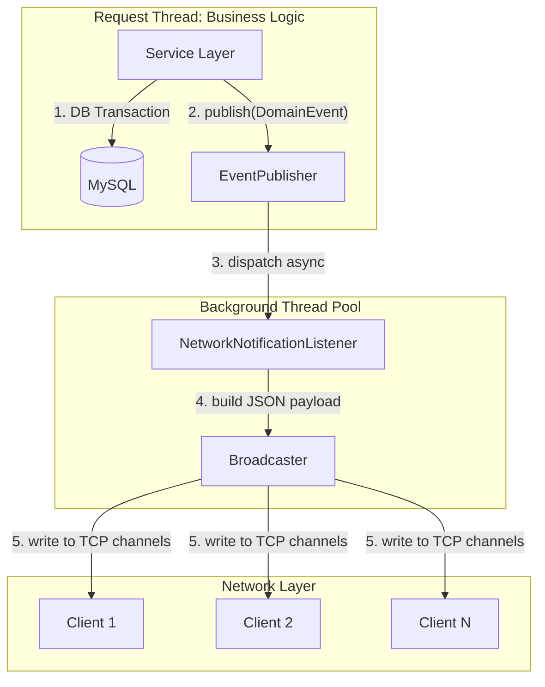
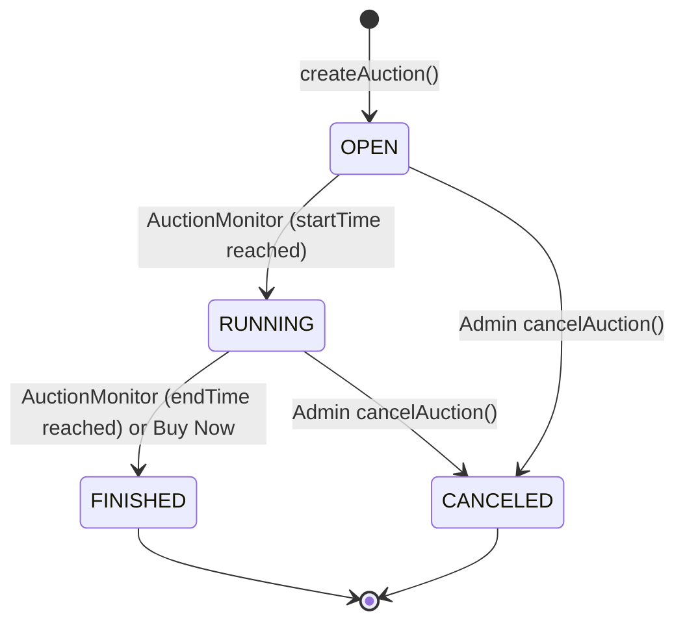

# System Architecture Overview

This document provides a comprehensive, high-level overview of the Bidding System's architecture — covering module structure, network layer, event-driven design, concurrency strategy, and advanced business rules.

---

## 1. Multi-Module Architecture

The project is structured as a multi-module Maven/Gradle build with strict separation of concerns:

| Module | Role |
|---|---|
| **`common`** | Shared domain models (`Auction`, `Product`, `Bid`, `User`), DTOs (request/response/notify), enums, and utilities (`JsonConverter`, `FileLogger`, `Config`). Consumed by both `server` and `client`. |
| **`server`** | High-performance multi-threaded TCP server. Enforces all business rules, manages auction lifecycles, processes financial transactions, and guarantees thread-safe data access via database-level locking. |
| **`client`** | JavaFX desktop application using MVC with `.fxml` layouts. Maintains a persistent socket connection to receive asynchronous server broadcasts and update the UI in real time. |

---

## 2. Network Layer & Request Dispatching

The system uses **persistent TCP Sockets** transmitting JSON payloads — eliminating HTTP overhead and enabling millisecond-level responses critical for live auctions.

### Command & Dispatcher Pattern

1. The client sends a JSON payload with a `type` field (e.g. `LOGIN`, `BID_PLACE`).
2. `SocketServer` (Java NIO) multiplexes connections via a `Selector` and dispatches reads to a worker thread pool.
3. `CommandHandler` resolves the correct `Command` from `CommandRegistry`.
4. The `Command` calls the appropriate service, which performs a DB transaction and publishes a domain event.
5. The direct `Response` is written back to the client's socket channel.

### Connection Lifecycle Management

*   **Heartbeat**: `HeartbeatRegistry` records the timestamp of every `PING` message. `InactivityMonitor` polls periodically and evicts clients silent for more than 60 seconds, reclaiming socket and memory resources.
*   **Graceful Disconnection**: `DisconnectionHandler` cleans up on unexpected drops — invalidating the session, removing the client from all auction rooms, and flushing buffers.

---

## 3. Event-Driven Notification System

Real-time UI updates for all watchers of an auction are driven by an internal **Publish-Subscribe** architecture, keeping domain services fully decoupled from the network layer.

**Key events published:**

| Event | Trigger | Broadcast target |
|---|---|---|
| `NewBidPlacedEvent` | Manual or auto bid placed | All clients in the auction room |
| `AuctionCreatedEvent` | New auction created | All connected clients |
| `AuctionStartedEvent` | OPEN → RUNNING transition | All connected clients |
| `AuctionEndedEvent` | Auction finalized or cancelled | All clients in the auction room |

**Benefits:**
*   The request thread returns a response to the bidder immediately, before any broadcast occurs.
*   `BidService` has zero knowledge of sockets, channels, or JSON serialization.

---

## 4. Persistence & Concurrency Control

### Connection Pooling
`DatabaseConnectionPool` (backed by HikariCP) maintains a configured pool of ready JDBC connections, eliminating per-request TCP handshake overhead.

### Transaction Management
`TransactionManager` provides three typed wrappers:

| Method | Use |
|---|---|
| `txManager.run(action)` | Mutations with no return value |
| `txManager.execute(action)` | Mutations that return a result |
| `txManager.query(action)` | Read-only queries |

Any unchecked exception inside the lambda triggers a full `ROLLBACK`. Successful completion triggers `COMMIT`.

### DAO Management
All DAOs (e.g., `AuctionDao`, `UserDao`) are implemented as **Singletons** and accessed via `getInstance()`. This ensures a single point of data access and consistent SQL handling across all services.

### Pessimistic Concurrency Control (Row-Level Locking)
To handle concurrent bids on the same auction, the system uses `SELECT ... FOR UPDATE` on both the `auctions` row and all involved `users` rows within a single transaction. This serialises concurrent bids at the database level — eliminating lost-update anomalies without application-level `synchronized` blocks.

**Deadlock prevention**: When two users must be locked simultaneously (bidder + previous winner), they are always locked in **alphabetical order** by `accountname`, ensuring a consistent acquisition order across all threads.

---

## 5. Advanced Business Capabilities

### A. Auction Lifecycle State Machine

### B. Auto-Bidding Engine
Users configure a `maxBid` ceiling and `incrementAmount`. After every manual bid, `runAutoBidding()` executes within the **same transaction**:
1. Fetches all active auto-bids for the auction, sorted by `maxBid DESC`, then `createdAt ASC` (tiebreak).
2. Computes the minimum price required to outbid the second-highest auto-bidder.
3. Applies the calculated bid on behalf of the top auto-bidder.
4. If the winning auto-bidder already leads, the loop terminates immediately.

### C. Anti-Sniper Protection
Any bid placed within the final `ANTI_SNIP_WINDOW_MS` (configurable) of an auction's end time automatically extends `end_time` by `ANTI_SNIP_EXTENSION_MS`. `AuctionMonitor` cancels the existing scheduled task and schedules a new one at the updated time, giving competing bidders a fair window to respond.

### D. Buy Now (Immediate Buyout)
If a seller sets a `buyNowPrice`, any bid meeting or exceeding it closes the auction instantly. The `end_time` is set to `NOW()` in the same transaction that processes the bid, and the `AuctionMonitor` reschedules accordingly.

### E. Two-Step Product Listing
Members can either:
- **One-step**: Use `createAuction()` to create a product and list it for auction simultaneously.
- **Two-step**: Use `createInventoryProduct()` to add a product to their inventory first, then use `openAuctionForProduct()` at a later time to create the auction. This allows sellers to prepare listings in advance.

### F. Product Withdrawal (Soft Delete)
Sellers can withdraw products from their inventory. This performs a **Soft Delete** by setting the `withdrawn_at` timestamp. A product can only be withdrawn if it is not currently in an active auction.

### G. Advanced Search and Filtering
The search logic supports keywords, categories, price ranges, and auction status (`isInAuction`) using a `LEFT JOIN` for unified results.

### H. Watchlist Management
Users can "watch" auctions to receive targeted "ending soon" notifications.

### I. Precision Timekeeping
`AuctionMonitor` uses a `ScheduledExecutorService` to fire auction start and end callbacks at exact timestamps — no polling, no busy loops. This guarantees sub-second accuracy for auction transitions with near-zero CPU overhead.