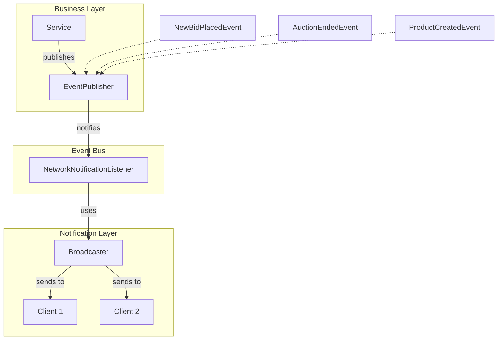

# Bidding System Overview & Event-Driven Architecture

This document provides a high-level overview of the project structure and the event-driven notification system.

## 🏗 Project Structure

The project is divided into three main modules:

1.  **`common`**: Contains shared data structures, including:
    *   **Models**: User, Item, Auction, Bid, etc.
    *   **DTOs**: Requests, Responses, and Notification payloads.
    *   **Utils**: JSON conversion, Configuration, and Logging.
2.  **`server`**: The core backend logic:
    *   **Network**: Socket-based server using NIO (Selector/Channel).
    *   **Commands**: Implementation of the Command Pattern for handling requests.
    *   **Services**: Business logic for Bidding, Finance, and User management.
    *   **Repository**: Data access layer (DAO) with JDBC.
3.  **`client`**: A client application/test suite that interacts with the server.

## 📢 Event-Driven Architecture (Observer Pattern)

The system uses an internal Event Bus to decouple business logic from notification logic.

### Key Components:
*   **`EventPublisher`**: A thread-safe event bus that manages subscribers and dispatches events.
*   **`DomainEvent`**: Base interface for all system events.
*   **`NetworkNotificationListener`**: Subscribes to events and converts them into network responses.
*   **`Broadcaster`**: Manages active socket connections and pushes JSON messages to clients.

## 🤝 Component Interaction

1.  **Request**: Client sends a JSON request via Socket.
2.  **Execution**: `CommandHandler` identifies the `Command`, which calls a `Service`.
3.  **State Change**: `Service` updates the database via `Repository`.
4.  **Event**: `Service` publishes a `DomainEvent` (e.g., `NewBidPlacedEvent`).
5.  **Notification**: `NetworkNotificationListener` receives the event and uses `Broadcaster` to update all interested clients in real-time.
