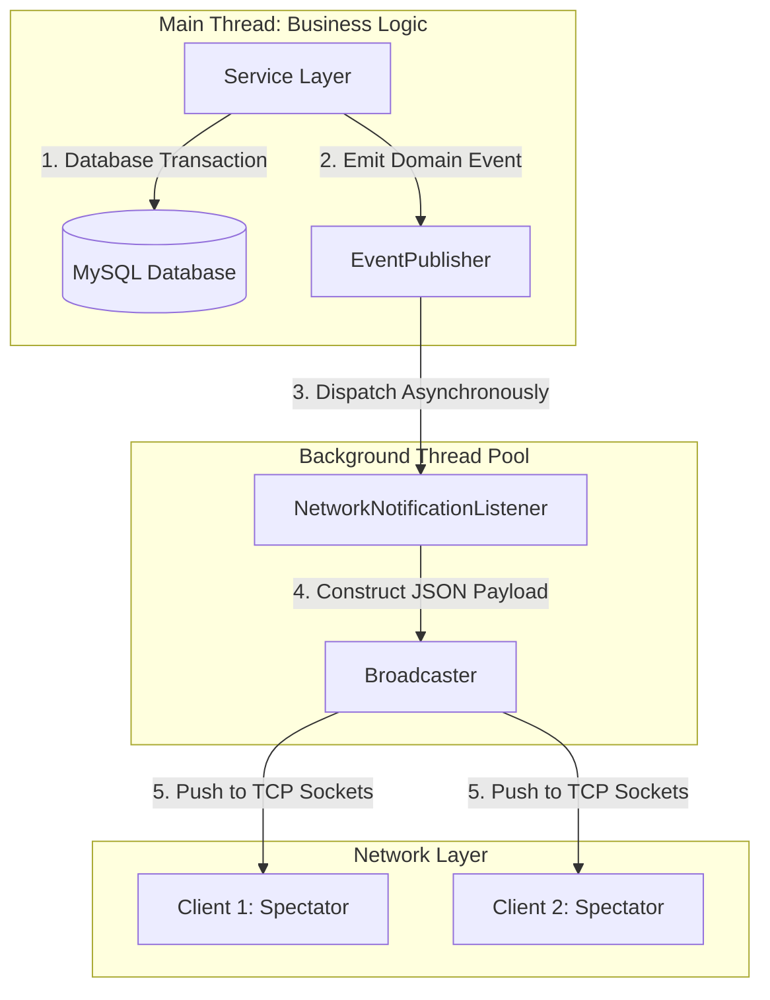

# System Architecture Overview

This document provides a comprehensive, high-level overview of the Bidding System's architecture. It explores data flows, network management, and the sophisticated handling of complex business rules that power this real-time platform.

---

## 🏗 1. Multi-Module Architecture

The system is engineered using a robust multi-module structure, strictly adhering to the **Separation of Concerns** principle. It is divided into three primary components:

1.  **`common` (Shared Core)**:
    *   **Domain Models**: Houses the core business entities (`User`, `Auction`, `Product`, `Transaction`).
    *   **Data Transfer Objects (DTOs)**: Defines the Request, Response, and Notification schemas, acting as the standard contract between the Client and Server.
    *   **Utilities**: Contains shared utilities like `JsonConverter` and logging mechanisms to ensure seamless data serialization/deserialization across the network.
2.  **`server` (Backend Engine)**:
    *   A high-performance, multi-threaded TCP server built on **Java NIO (Non-blocking I/O)**.
    *   Responsible for enforcing business rules, managing auction lifecycles, processing financial transactions, and ensuring thread-safe data access via database locking.
3.  **`client` (Frontend Application)**:
    *   A rich Desktop application built with **JavaFX** utilizing the Model-View-Controller (MVC) architectural pattern.
    *   Maintains a persistent, underlying socket connection with the server to render real-time UI updates based on asynchronous server broadcasts.

---

## 🌐 2. Network Layer & Request Dispatching

Unlike traditional HTTP/REST APIs, the Bidding System utilizes **persistent TCP Sockets** transmitting structured JSON data. This design choice drastically reduces overhead, enabling ultra-fast, millisecond-level responses essential for a live auction environment.

### The Command & Dispatcher Pattern
To maintain a clean and scalable codebase, the server employs the **Command Pattern** for request handling:
1.  The Client transmits a JSON payload containing a specific `"type"` identifier (e.g., `LOGIN`, `BID_PLACE`).
2.  The `SocketServer` reads the byte stream and delegates it to the `CommandHandler`.
3.  The `CommandHandler` queries the `CommandRegistry` to instantiate the appropriate handler class (e.g., `LoginCommand`, `BidPlaceCommand`).
4.  This specific Command acts as a Controller, executing the required business logic within the Service layer and generating a corresponding `Response`.

### Resource & Connection Management
*   **Heartbeat Mechanism**: An `InactivityMonitor` continuously tracks `PING` packets from clients. If a client remains unresponsive for over 60 seconds, the connection is actively terminated to reclaim RAM and socket resources.
*   **Graceful Disconnection**: The `DisconnectionHandler` intercepts unexpected disconnects (e.g., network drops), ensuring the user's session is invalidated, they are removed from active auction rooms, and memory buffers are purged safely.

---

## 📢 3. Event-Driven Notification System

To solve the challenge of simultaneously updating hundreds of connected clients when a bid occurs, the server implements an internal **Publish-Subscribe (Pub/Sub)** architecture.

**Architectural Benefits:**
*   **Asynchronous Execution**: By offloading notification duties to a dedicated ThreadPool, the main request-handling thread is instantly freed, guaranteeing low latency for the user who initiated the action.
*   **Strict Decoupling**: Financial services (like `BidService`) are completely agnostic to the networking layer. They simply declare *state changes* (e.g., "A bid was placed"), leaving the routing and broadcasting to specialized event listeners.

---

## 🛠 4. Persistence & Concurrency Control

The database tier is the ultimate guardian against race conditions, lost updates, and financial discrepancies.

1.  **Connection Pooling (HikariCP)**: Maintains a pool of ready-to-use MySQL connections, drastically reducing the overhead of opening and closing connections for every transaction.
2.  **Transaction Management**: Operations that mutate state (e.g., placing a bid, transferring funds) are encapsulated within strict Database Transactions. If any step fails (e.g., insufficient funds), a complete `ROLLBACK` is triggered to maintain system consistency.
3.  **Pessimistic Concurrency Control (Row-Level Locking)**: To handle concurrent bids on the same auction:
    *   The system executes `SELECT ... FOR UPDATE` queries against the `auctions` and `users` tables.
    *   This instructs the database engine to lock specific rows. If two users bid at the exact same millisecond, the database queues the second request until the first transaction completes, absolutely eliminating **Lost Update** anomalies.

---

## 🔥 5. Advanced Business Capabilities

### A. Automated Bidding (Auto-Bids)
Users can establish a maximum willingness to pay (Max Bid) and an increment step. When competing bids arrive, the server autonomously generates counter-bids on behalf of the user until their limit is exhausted. This logic executes at CPU-speed entirely on the backend.

### B. Anti-Sniper Protection
"Snipping" involves placing a bid in the final seconds to prevent others from responding. To ensure fair market value:
*   Any bid placed within the final `N` minutes of an auction triggers an automatic extension of the `end_time` by `M` minutes.
*   The `AuctionMonitor` seamlessly intercepts this database update, canceling the impending closure task and scheduling a new one.

### C. Immediate Buyout ("Buy Now")
Sellers can assign a definitive buyout price to an item.
*   If a user submits a bid equal to or exceeding the `buy_now_price`, the system immediately resolves the auction at that price. It overrides all competing Auto-Bids and instantaneously rewinds the auction's `end_time` to the current timestamp, closing the event.

### D. Precision Timekeeping (Auction Monitor)
Rather than executing resource-intensive database polling to detect ended auctions, the system utilizes a `ScheduledExecutorService`. Upon auction creation, an exact closure task is scheduled down to the millisecond. This ensures pinpoint accuracy and near-zero CPU idle-waste.
