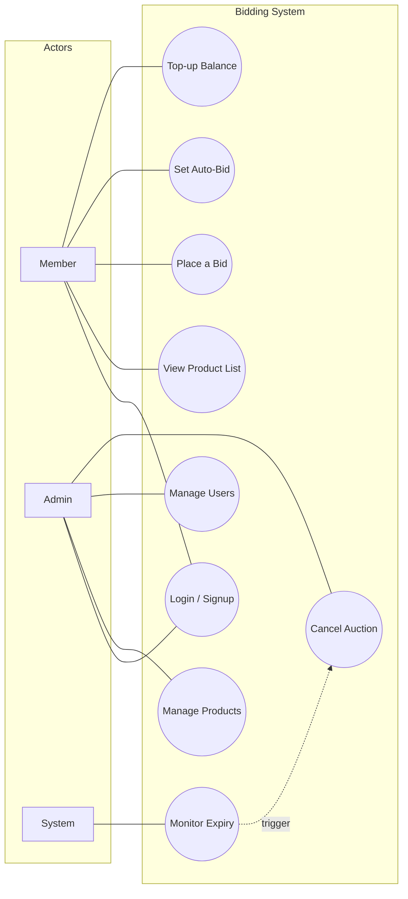

# Bidding System Use Case Diagram

```mermaid
graph LR
    subgraph Actors
        M[Member]
        A[Admin]
        S[System]
    end

    subgraph "Bidding System"
        UC1((Login / Signup))
        UC2((View Product List))
        UC3((Place a Bid))
        UC4((Set Auto-Bid))
        UC5((Top-up Balance))
        UC6((Manage Products))
        UC7((Manage Users))
        UC8((Cancel Auction))
        UC9((Monitor Expiry))
    end

    M --- UC1
    M --- UC2
    M --- UC3
    M --- UC4
    M --- UC5

    A --- UC1
    A --- UC6
    A --- UC7
    A --- UC8

    S --- UC9
    UC9 -. trigger .-> UC8
```
