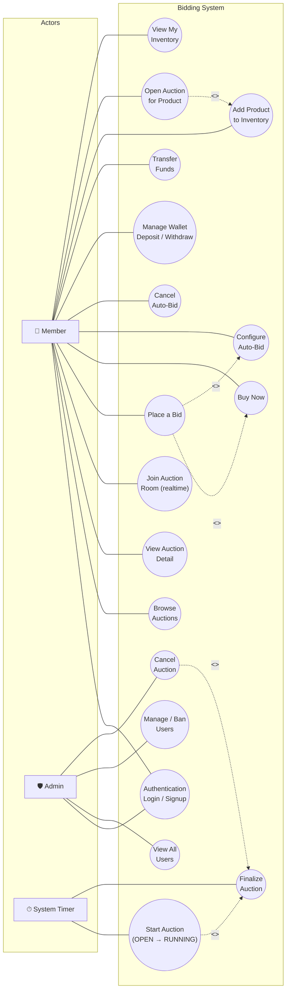

# Use Case Diagram

This document illustrates the interactions between system actors and the Bidding System, mapping business requirements to actor capabilities.

## 1. System Actors

| Actor | Description |
|---|---|
| **Member** | A standard registered user who can sell items, place bids, configure auto-bids, and manage their wallet. |
| **Admin** | A privileged operator responsible for system oversight, user moderation, and auction intervention. |
| **System Timer** | An automated background actor (`AuctionMonitor`) that triggers time-sensitive lifecycle events without user interaction. |

## 2. Use Case Diagram

## 3. Use Case Descriptions

### Member Actions

| Use Case | Description |
|---|---|
| **Authentication** | Register a new account or log in to an existing one. |
| **Browse Auctions** | View a paginated list of all active auction listings. |
| **View Auction Detail** | See full product information, current price, bid history, and time remaining. |
| **Join Auction Room** | Subscribe to realtime bid updates for a specific auction via the socket room mechanism. |
| **Place a Bid** | Submit a manual bid above the current price by at least one `stepPrice`. Funds equal to the bid amount are frozen in escrow immediately. The previous leader's escrow is released. |
| **Buy Now** | Submit a bid that meets or exceeds the `buyNowPrice`. The auction ends immediately at the submitted bid amount. |
| **Configure Auto-Bid** | Set a `maxBid` ceiling and `incrementAmount`. The server will automatically outbid competitors on the user's behalf up to their ceiling. |
| **Cancel Auto-Bid** | Deactivate an active auto-bid configuration. |
| **Manage Wallet** | Deposit funds into the account or withdraw available (non-escrowed) funds. |
| **Transfer Funds** | Send balance to another registered user. |
| **Add Product to Inventory** | Create a product record (name, category, images) without immediately listing it. |
| **Open Auction for Product** | List an owned, non-auctioned inventory product with a price and schedule. |
| **View My Inventory** | See all products owned by the logged-in user and their auction status. |

### Admin Actions

| Use Case | Description |
|---|---|
| **View All Users** | Browse the full user list with account details and status. |
| **Manage / Ban Users** | Suspend an account that violates platform terms. Banned users cannot bid or create listings. |
| **Cancel Auction** | Forcefully cancel an `OPEN` or `RUNNING` auction. The current leader's escrowed funds are released, and the product returns to inventory. |

### Automated System Actions

| Use Case | Description |
|---|---|
| **Start Auction** | `AuctionMonitor` detects `OPEN` auctions whose `start_time` has passed and transitions them to `RUNNING`, scheduling their end task. |
| **Finalize Auction** | Triggered on `end_time` (normal) or by an admin (forced cancel). Resolves the winner, transfers funds from escrow to seller, transfers product ownership, and broadcasts the result to all connected clients. |