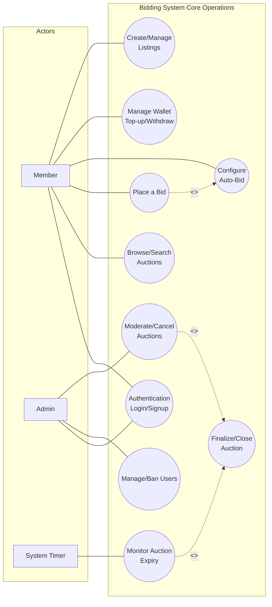

# Use Case Diagram

This document illustrates the interactions between different actors and the Bidding System. It visualizes the core functional requirements and the boundaries of user capabilities.

## 1. System Actors

The system identifies three primary actors:
*   **Member**: A standard registered user who interacts with the core bidding functionalities (buying, selling, managing funds).
*   **Admin**: A privileged user responsible for system oversight, user management, and moderation.
*   **System Timer**: An automated background actor that triggers time-sensitive events independently of user interaction.

## 2. Use Case Diagram

## 3. Use Case Descriptions

### Member Actions
*   **Browse/Search Auctions**: Members can view active listings, read descriptions, and monitor current highest bids in real-time.
*   **Place a Bid**: Members can submit manual bids on active items. The system validates their account balance and freezes necessary funds (escrow).
*   **Configure Auto-Bid**: Members can set a maximum price and increment. The system will automatically place bids on their behalf.
*   **Manage Wallet**: Members can view their available balance, see funds locked in escrow, and simulate top-ups.
*   **Create Listings**: Members can put their own items up for auction, defining starting prices, categories, and optional "Buy Now" prices.

### Admin Actions
*   **Manage Users**: Admins have the authority to suspend or ban users who violate platform terms.
*   **Moderate Auctions**: Admins can intervene and forcefully cancel an auction if it contains inappropriate content or fraudulent activity.

### Automated System Actions
*   **Monitor Auction Expiry**: The internal time scheduler actively tracks the end time of all ongoing auctions.
*   **Finalize/Close Auction**: Triggered by either the Time Scheduler (time expired) or an Admin (forced cancellation). This use case resolves the winner, transfers funds from escrow to the seller, and notifies all participants.
